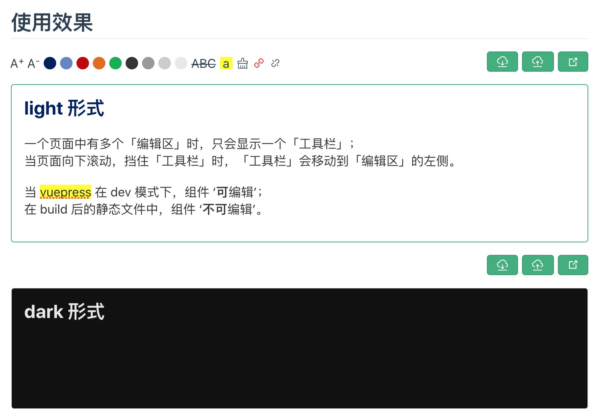

# [@talltotal/vuepress-plugin-editor](https://talltotal.github.io/vuepress-plugin-editor/)

在文档中做一些简单的富文本操作。


## install
```bash
yarn add -D @talltotal/vuepress-plugin-editor
# OR npm install -D @talltotal/vuepress-plugin-editor
```

## Usage
### 在 `config.js` 中引入
```js
module.exports = {
    plugins: ['@talltotal/vuepress-plugin-editor'] 
}
```

### 在 md 文档中使用
直接在文档中以组件元素的形式使用，接收两个参数：
- `name` 模块的名字，需全站唯一
- `type` ‘light’或‘dark’，主题色
- `hideControls` 隐藏操作区
- `minArea` 在组件内划分横向的区域数

```md
<editor name="file-name" />

<editor name="file-name1" type="dark" />
```


### 编辑区快捷键
- tab：4个空格
- command+-：字体缩小
- command++：字体放大
- command+s：保存提交
- command+b：加粗
- command+i：斜体


